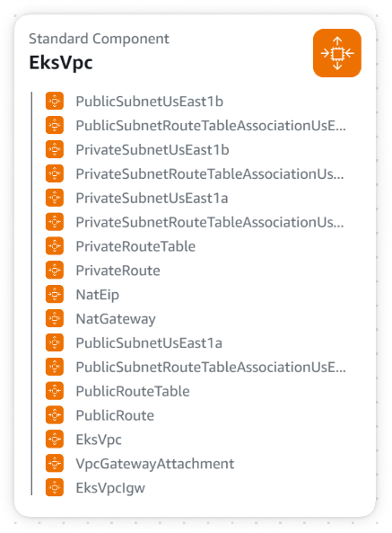
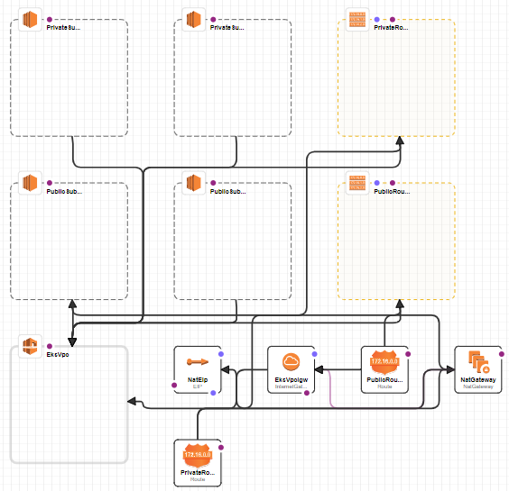

# CloudFormation Template for Creating EKS Cluster and Node Group
This CloudFormation template creates an Elastic Kubernetes Service (EKS) cluster and associated Node Group on AWS. It also provisions the required network infrastructure and IAM roles. Below is a detailed description of each resource, its type, and purpose.

## Resources
### 1. EksVpc
- **Type:** AWS::EC2::VPC
- **Description:** Creates a Virtual Private Cloud (VPC) which provides a network environment for the EKS cluster.
- **Purpose:** To establish an isolated network environment where the EKS cluster will operate.
### 2. EksVpcIgw
- **Type:** AWS::EC2::InternetGateway
- **Description:** Creates an Internet Gateway to enable internet access for the VPC.
- **Purpose:** To allow resources within the VPC to access the internet.
### 3. VpcGatewayAttachment
- **Type:** AWS::EC2::VPCGatewayAttachment
- **Description:** Attaches the Internet Gateway to the VPC.
- **Purpose:** To link the Internet Gateway with the VPC for internet connectivity.
### 4. PublicSubnetUsEast1a
- **Type:** AWS::EC2::Subnet
- **Description:** Creates a public subnet in the 'us-east-1a' Availability Zone.
- **Purpose:** To provide a network segment for the EKS cluster and other public-facing services.
### 5. PublicSubnetUsEast1b
- **Type:** AWS::EC2::Subnet
- **Description:** Creates a public subnet in the 'us-east-1b' Availability Zone.
- **Purpose:** To provide a network segment for the EKS cluster and other public-facing services.
### 6. PublicRouteTable
- **Type:** AWS::EC2::RouteTable
- **Description:** Creates a route table for public subnets.
- **Purpose:** To define routing rules for public subnets, including internet access.
### 7. PublicRoute
- **Type:** AWS::EC2::Route
- **Description:** Defines a route for public subnets to access the internet (0.0.0.0/0).
- **Purpose:** To enable internet access for resources in public subnets.
### 8. PublicSubnetRouteTableAssociationUsEast1a
- **Type:** AWS::EC2::SubnetRouteTableAssociation
- **Description:** Associates the 'us-east-1a' public subnet with the route table.
- **Purpose:** To ensure that the 'us-east-1a' public subnet has internet access through the route table.
### 9. PublicSubnetRouteTableAssociationUsEast1b
- **Type:** AWS::EC2::SubnetRouteTableAssociation
- **Description:** Associates the 'us-east-1b' public subnet with the route table.
- **Purpose:** To ensure that the 'us-east-1b' public subnet has internet access through the route table.
### 10. EksRole
- **Type:** AWS::IAM::Role
- **Description:** Creates an IAM role for the EKS cluster with the necessary permissions.
- **Purpose:** To grant the EKS cluster the required permissions to access AWS resources.
### 11. EksCluster
- **Type:** AWS::EKS::Cluster
- **Description:** Creates an EKS cluster configured to run within the specified VPC.
- **Purpose:** To provide a managed Kubernetes cluster for running containerized applications.
### 12. EksNodeRole
- **Type:** AWS::IAM::Role
- **Description:** Creates an IAM role for the EKS Node Group's EC2 instances with necessary permissions.
- **Purpose:** To allow EC2 instances in the EKS Node Group to interact with AWS services.
### 13. EksNodeGroup
- **Type:** AWS::EKS::Nodegroup
- **Description:** Creates a Node Group within the EKS cluster, specifying the desired EC2 instance types and scaling configuration.
- **Purpose:** To provide a group of EC2 instances that will run workloads within the EKS cluster.


<table align="center">
  <tr>
    <td></td>
    <td></td>
  </tr>
  <tr>
    <td align="center"><a  title="Settings">Components</a></td>
    <td align="center"><a  title="Settings">Resources</a></td>
  </tr>
</table>


# GitHub Actions Workflow for Deploying EKS Cluster and Setting Up Argo CD
This GitHub Actions workflow automates the deployment of an Amazon EKS cluster using CloudFormation and sets up Argo CD on the newly created EKS cluster. Below is a detailed description of each job and step in the workflow.

## Workflow Overview
The workflow is triggered manually via the GitHub Actions interface. It consists of two main jobs:

**1. Deploy EKS Cluster:** Deploys an EKS cluster using AWS CloudFormation.  
**2. Setup Argo CD:** Sets up Argo CD on the deployed EKS cluster.
## Workflow Definition
### a- 'deploy-eks-cluster' Job
**Purpose:** Deploys an EKS cluster using a CloudFormation stack.

**Steps:**

### 1. Checkout Repository

- **Description:** Checks out the code from the repository so that the workflow can access the CloudFormation template.
- **Action:** actions/checkout@v2
### 2. Configure AWS Credentials

- **Description:** Configures AWS credentials required for deploying the CloudFormation stack.
- **Action:** aws-actions/configure-aws-credentials@v2
- **Inputs:**
  - **aws-access-key-id:** AWS access key ID stored in GitHub Secrets.
  - **aws-secret-access-key:** AWS secret access key stored in GitHub Secrets.
  - **aws-region:** AWS region where the resources will be deployed (us-east-1).
### 3. Deploy CloudFormation Stack

- **Description:** Deploys the CloudFormation stack to create the EKS cluster and related resources.
- **Command:**
```sh
aws cloudformation deploy \
  --stack-name eks-cluster-stack \
  --template-file ./eks-temel.yaml \
  --capabilities CAPABILITY_NAMED_IAM
```


```sh

    - name: Docker Login
      run: docker login --username ${{ secrets.DOCKER_USERNAME }} -p ${{ secrets.DOCKER_PWD }}

```